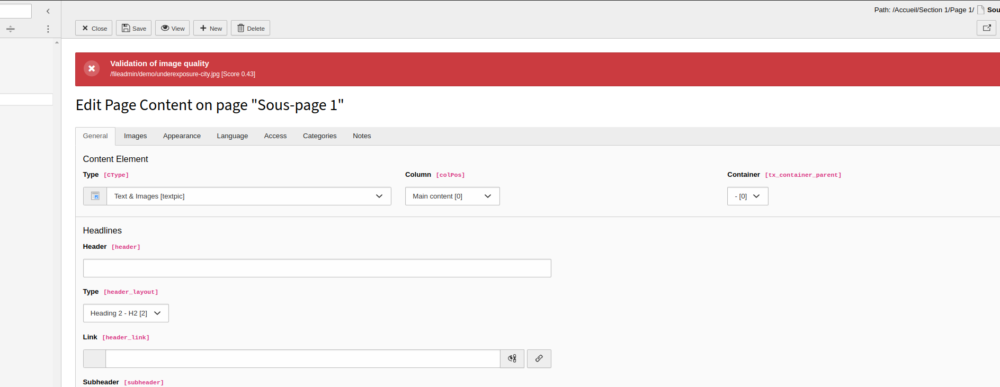
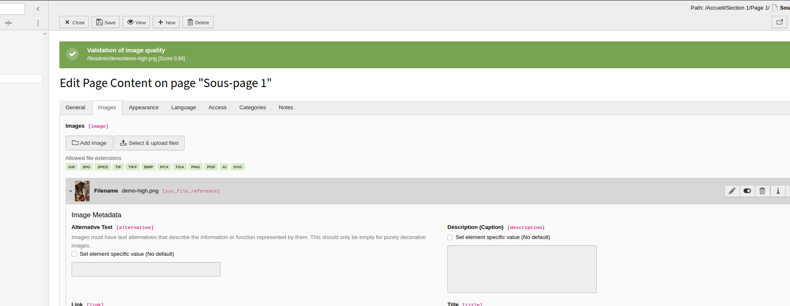

Use Sightengine (AI) to check quality of images selected by editors.

# Installation & Configuration

1. Install the extension via composer.

2. Add the api key and secret in the configuration module of TYPO3.

# User Guide

When user save a record with a selected image, a warning message is displayed if the image quality is not good enough. The image is saved as usual.

If the quality is enough, a notice with a score is displayed nevertheless.

## Example of warning

## Example of notice

